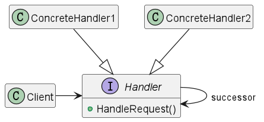

## 职责链模式

### 意图

使多个对象都有机会处理请求，从而避免请求的发送者和接收者之间的耦合关系。

将这些对象连成一条链，并沿着这条链传递该请求，直到有一个对象处理它为止。

### 适用性

* 有多个的对象可以处理一个请求，哪个对象处理该请求运行时刻自动确定。
* 你想在不明确指定接收者的情况下，向多个对象中的一个提交一个请求。
* 可处理一个请求的对象集合应被动态指定。

### 结构

### 参与者

* Handler 
    * 定义一个处理请求的接口。
    * (可选)实现后继链。
* ConcreteHandler
    * 处理它所负责的请求。
    * 可访问它的后继者。
    * 如果可处理该请求，就处理之；否则就将该请求转发给它的后继者。
* Client
    * 向链上的具体处理者对象提交请求。

### 协作

当客户提交一个请求时，请求沿链传递直至有一个ConcreteHandler对象负责处理它。

### 效果

* 降低耦合度。
* 增强给对象指派职责的灵活性。
* 不保证请求一定被接收。

### 实现

**说明：**

假如规定学生请求少于3天，班主任可以批准；请求在3到7天之间，系主任可以批准；请求在7到10天之间，院长可以批准；请求超过10天，就不予批准。

**代码：**

见[职责链模式-Demo](ChainOfResponsibility)