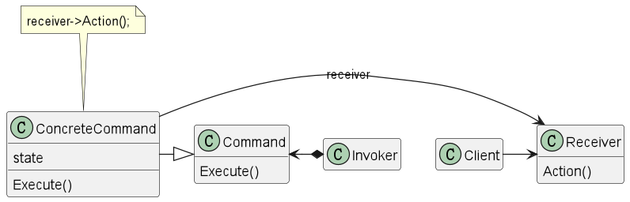

## 命令模式

### 意图

> 将一个请求封装为一个对象，从而使你可以用不同的请求对客户进行参数化；对请求排队或记录请求日志，以及支持可撤销的操作。

### 适用性

* 回调函数（它也是先注册函数，然后再在需要的时候被调用）
* 在不同时刻指定、排列和执行请求（可以把命令传到别的进程去执行，而且也可以不是即时执行）
* 支持取消操作 （将实施操作前的状态存储起来，取消操作时，恢复该状态）
* 支持修改日志，这样当系统崩溃时，这些修改可以被重做一遍。
* 用构建在原语操作上的高层操作构造一个系统（这不就C语言与PHP的关系嘛）

### 结构

### 参与者

* Command -声明执行操作的接口

* ConcreteCommand 
  
  -将一个接收者对象绑定于一个动作
  
  -调用接收者相应的操作，以实现Execute

* Client -要求改命令执行这个请求

* Receiver -螺丝钉，知道如何实施与执行一个请求相关的操作。跟你我一样，别人一句命令，俺们赴汤蹈火（狗头）

