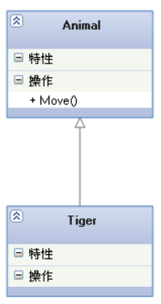
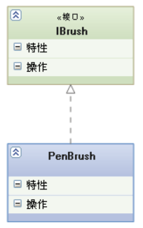
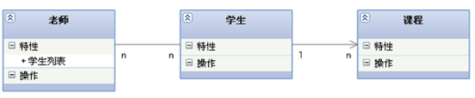

## 什么是设计模式
解决重复发生的问题的方案。

## 设计模式的基本要素

+ 模式名称(pattern name)
+ 问题 (problem)
+ 解决方案 (solution)
+ 效果 (consequences)

## 基础小知识

### 类之间的关系

#### 泛化(generalization)
定义：是一种继承关系，表示一般与特殊的关系，它指定了子类如何特化父类的所有特征和行为。

例如：猫是动物的一种，猫既有动物的特征，又有猫的特征。

箭头指向：带空心三角形的实线箭头，箭头指向父类。

#### 实现(realization)
定义：是一种类与接口的关系，表示类是接口所有特征和行为的实现。

箭头指向：带空心三角形的虚线箭头，箭头指向接口。

#### 关联(association)
定义：是一种拥有的关系，它使一个类知道另一个类的属性和方法。

箭头指向：双向的关联可以有两个箭头或者没有箭头，单向的关联只有一个箭头，箭头指向被拥有的一方。

#### 聚合(aggregation)
