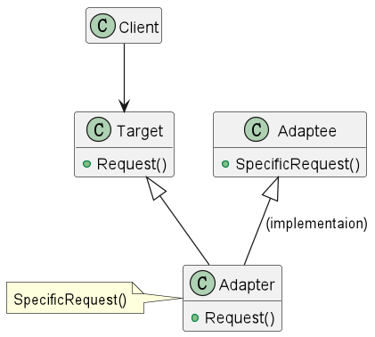
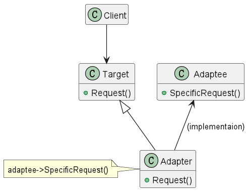

## 适配器模式

### 意图
> 将一个类的接口转换成客户希望的另外一个接口。Adapter模式使得原本由于接口不兼容而不能一起工作的那些类可以一起工作。

### 别名
包装器 Wrapper

### 适用性

* 你想使用一个已经存在的类，而它的接口不符合你的需求。
* 你想创建一个可以复用的类，该类可以与其他不相关的类或不可预见的类协同工作。
* 你想使用一些已经存在的子类，但是不可能对每一个都进行子类化以匹配它们的接口。对象适配器可以适配它的父类接口。

### 结构

#### 类适配器

类适配器使用多重继承来实现，它继承了所需的接口并实现了所需的功能。



#### 对象适配器

对象适配器使用对象组合来实现，它持有所需的接口并实现了所需的功能。



### 参与者

* Target -- 定义Client使用的与特定领域相关的接口。
* Client -- 与符合Target接口的对象协同。
* Adaptee -- 定义一个已经存在的接口，这个接口需要适配。
* Adapter -- 适配器，从Adaptee到Target的接口转换器。

### 协作

* Client在Adapter实例上调用所需的方法。适配器将调用Adaptee的方法，并将结果返回给Client。

### 效果

类适配器和对象适配器有不同的权衡。

#### 类适配器

* 用一个具体的Adapter类对Adaptee和Target进行匹配。
* 使得Adapter可以重定义Adaptee的部分行为，因为Adapter是Adaptee的一个子类。
* 仅仅引入一个对象，并不需要额外的指针以间接得到Adaptee。

#### 对象适配器

* 一个Adapter可以把多个Adaptee适配到同一个Target。
* 使得重定义Adaptee的行为比较困难。这就需要生成一个Adaptee的子类，并使Adapter引用这个子类，而不是引用Adaptee本身。

### 实现

#### 类适配器

**说明：** 本例中，我们将使用一个类适配器来将iPhone的耳机接口转换成标准的3.5mm耳机接口。

> Adaptee(被适配者)

```php
<?php
namespace DesignPatterns\Structural\Adapter;

class IphoneHeadset
{
   /**
    * 需要被适配的耳机接口
    */
    public function useLightning()
    {
        echo 'Using lightning port...'.PHP_EOL;
    }
}
```

> Target(目标)

```php
<?php
namespace DesignPatterns\Structural\Adapter;

interface HeadsetInterface
{
    /**
     * 新标准耳机接口
     */
    public function use35mm();
}
```

> Adapter(适配器)

```php
<?php
namespace DesignPatterns\Structural\Adapter;

class HeadsetAdapter extends IphoneHeadset implements HeadsetInterface
{
    /**
     * 采用继承的方式实现适配
     * 适配器实现新标准耳机接口
     */
    public function use35mm()
    {
        // 调用被适配者的方法，对其进行增强或者修改
        $this->useLightning();
        var_dump('----转换为标准耳机接口----');
        var_dump('----哎呀哎呀，我变成标准耳机接口了----');
    }
}
```

> Client(客户端)

```php
<?php
namespace DesignPatterns\Structural\Adapter;

require __DIR__ . '/../../../vendor/autoload.php';

// 实例化适配器
$headset = new HeadsetAdapter();
// 调用适配器的方法
$headset->use35mm();
```

#### 对象适配器

对象适配器与类适配器的区别在于，对象适配器采用组合的方式实现适配。

> Adapter(适配器)

```php
<?php
namespace DesignPatterns\Structural\Adapter;

class HeadsetAdapter implements HeadsetInterface
{
    /**
     * @var IphoneHeadset
     */
    private $iphoneHeadset;

    /**
     * 采用组合的方式实现适配
     */
    public function __construct(IphoneHeadset $iphoneHeadset)
    {
        $this->iphoneHeadset = $iphoneHeadset;
    }

    /**
     * 适配器实现新标准耳机接口
     */
    public function use35mm()
    {
        // 调用被适配者的方法
        $this->iphoneHeadset->useLightning();
        var_dump('----转换为标准耳机接口----');
        var_dump('----哎呀哎呀，我变成标准耳机接口了----');
    }
}
```