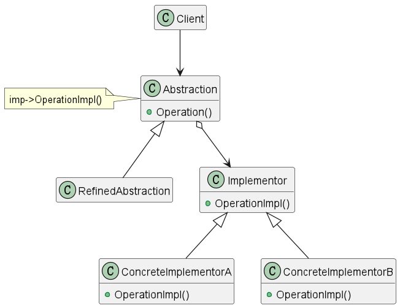

## 桥接模式

### 意图

> 将抽象部分与它的实现部分分离，使它们都可以独立地变化。

### 适用性

* 你不希望在抽象和它的实现部分之间有一个固定的绑定关系。例如这种情况可能是因为，在程序运行时刻实现部分应可以被选择或者切换。
* 类的抽象以及它的实现都应该可以通过生成子类的方法加以扩充。这时Bridge模式使你可以对抽象部分和实现部分进行独立的扩充，而不会影响到对方。
* 对于那些可能有多种实现方式的类，只有抽象部分和实现部分间的桥接才能解决这个问题。

### 结构



### 参与者

* Abstraction -- 定义抽象类的接口 
* RefinedAbstraction -- 扩充由Abstraction定义的接口
* Implementor -- 定义实现类的接口，这个接口不一定要与Abstraction的接口完全一致。事实上这两个接口可以非常不一样。一般而言，Implementor接口仅提供基本操作，而Abstraction定义的接口可能会做更多更复杂的操作。
* ConcreteImplementor -- 实现Implementor接口并定义它的具体实现。

### 协作
Abstraction将client的请求转发给它的Implementor对象

### 效果

* 分离抽象接口及其实现部分。
* 提高了系统的可扩充性，在两个变化维度中的任何一个变化都不会影响到另一个维度。
* 实现细节对客户透明。

### 实现

**说明:** 本例中，有两个维度，一个是颜色，一个是形状。每个维度都有两个实现，因此一共有四个实现。这四个实现都是通过桥接模式来实现的。

> Implementor 

```php
<?php
public interface color
{
    public function bepaint($shape);
}
```

> ConcreteImplementor 

```php
<?php
public class Red implements color
{
    public function bepaint($shape)
    {
        echo "红色的".$shape;
    }
}
```

```php
<?php
public class Green implements color
{
    public function bepaint($shape)
    {
        echo "绿色的".$shape;
    }
}
```

> Abstraction 

```php
<?php
public abstract class Shape
{
    protected $color;
    public function __construct($color)
    {
        $this->color = $color;
    }
    abstract public function draw();
}
```

> RefinedAbstraction 

```php
<?php
public class Circle extends Shape
{
    public function __construct($color)
    {
        parent::__construct($color);
    }
    public function draw()
    {
        $this->color->bepaint("圆形");
    }
}
```

```php
<?php
public class Square extends Shape
{
    public function __construct($color)
    {
        parent::__construct($color);
    }
    public function draw()
    {
        $this->color->bepaint("正方形");
    }
}
```

> Client 

```php
<?php
$red = new Red();
$circle = new Circle($red);
$circle->draw();
```

效果:

> 红色的圆形
