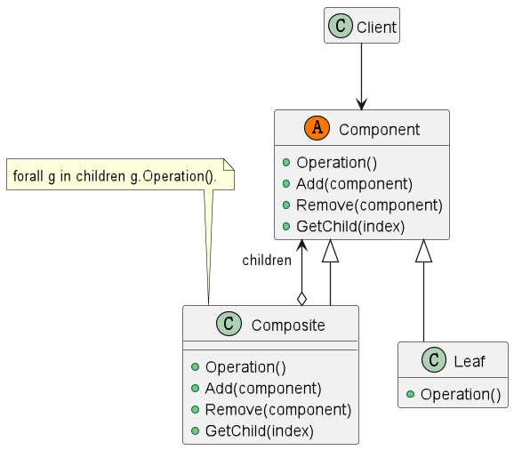

## 组合模式

### 意图

将对象组合成树形结构以表示“部分-整体”的层次结构。组合模式使得用户对单个对象和组合对象的使用具有一致性。

### 适用性

* 你想表示对象的部分-整体层次结构（树形结构）。
* 你希望用户忽略组合对象与单个对象的不同，用户将统一地使用组合结构中的所有对象。

### 结构



### 参与者

* Component -- 定义参与者共有的接口。
* Leaf -- 在组合中表示叶节点对象，叶节点没有子节点。
* Composite -- 定义有子部件的那些部件的行为。存储子部件，在 Component 接口中实现与子部件有关的操作。
* Client -- 通过 Component 接口操纵组合部件的对象。

### 协作

* Client 通过 Component 接口操纵组合部件的对象。

### 效果  

* 定义了包含基本对象和组合对象的类层次结构。
* 简化客户代码。客户可以一致地使用组合结构或其中单个对象。
* 容易增加新的构件类型。
* 使设计变得更加一般化。客户端不必区分组合对象和单个对象，它们将被一视同仁。

### 实现

**说明：** 本例中，我们将使用一个简单的文件系统来演示组合模式。文件系统中的每个文件都可以是一个文件夹，文件夹中可以包含文件和文件夹。文件夹中的文件和文件夹可以被看作是一个整体，因此我们可以使用组合模式来实现。

见 [Composite-demo](Composite-demo)

效果：

```
-root
---Leaf A
---Leaf B
---Composite X
-----Leaf XA
-----Leaf XB
-----Composite XY
-------Leaf XYA
-------Leaf XYB
---Leaf C
```


