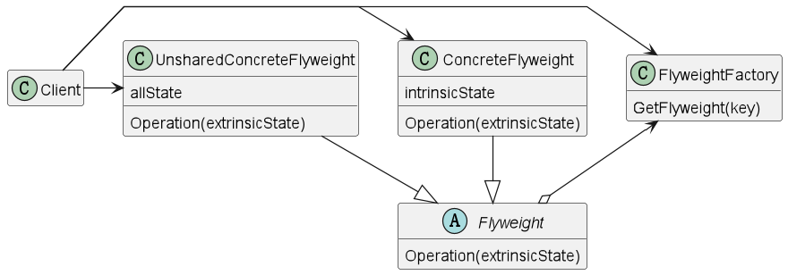

## 享元模式

### 意图

> 运用共享技术有效地支持大量细粒度的对象

### 适用性

* 一个应用程序使用了大量的对象
* 完全由于使用大量的对象，造成很大的存储开销
* 对象的大多数状态都可以变为外部状态
* 如果删除对象的外部状态，那么可以用相对较少的共享对象取代很多组对象
* 应用程序不依赖于对象标识

### 结构



### 状态

享元模式中存在以下两种状态：

* 内部状态：存储在享元对象内部并且不会随环境改变而改变的共享部分
* 外部状态：随环境改变而改变的不可以共享的状态

### 参与者

* Flyweight（抽象享元角色）
  * 描述一个接口，同这个接口flyweight可以接受并作用于外部状态
* ConcreteFlyweight（具体享元）
    * 实现Flyweight接口，并为内部状态增加存储空间
* UnsharedConcreteFlyweight（非享元角色）
    * 并非所有的Flyweight子类都需要被共享
* FlyweightFactory（享元工厂）
    * 创建并管理flyweight对象
    * 确保合理地共享flyweight
    * 当用户请求一个flyweight时，flyweightFactory对象提供一个已创建的实例或者创建一个（如果不存在的话）
* Client（客户端）
    * 维持一个对flyweight的引用
    * 计算或存储一个（多个）flyweight的外部状态

### 协作

* flyweight执行时所需的状态必定是内部的或外部的。内部状态存储于ConcreteFlyweight对象之中；而外部对象则由Client对象存储或计算。
* 用户不应直接对ConcreteFlyweight类进行实例化，而只能从FlyweightFactory对象得到ConcreteFlyweight对象，这可以保证对它们适当地进行共享。

### 实现
**说明：**

俄罗斯方块。俄罗斯方块都是由相同的小块组合而成的，颜色也不同。

见[Flyweight-demo](Flyweight-demo)

> AbstractBox：抽象享元角色
> 
> 颜色属性是外部状态，而形状属性是内部状态。
> 
> 内部状态由ConcreteBox类来实现，外部状态由Client类来实现。

```php
<?php

declare(strict_types=1);

abstract class AbstractBox
{
    abstract public function getShape(): string;

    public function display(string $color): void
    {
        echo "报告：方块形状为： {$this->getShape()}，颜色是： {$color}", PHP_EOL;
    }

}

```

> ConcreteBox：具体享元角色

```php
<?php

declare(strict_types=1);

require_once "AbstractBox.php";

class TriangleBox extends AbstractBox
{
    public function getShape(): string
    {
        return 'triangle';
    }
}

class SquareBox extends AbstractBox
{
    public function getShape(): string
    {
        return 'square';
    }
}

class CircleBox extends AbstractBox
{
    public function getShape(): string
    {
        return 'circle';
    }
}

```

> BoxFactory：享元工厂
> 
> 享元工厂类用来创建和管理享元角色，本类中提供了一个getBox()方法，该方法用于返回一个享元对象。
> 
> 享元工厂类中包含了一个享元池，用于存储已经创建的享元对象，当用户请求一个享元对象时，享元工厂类会先从享元池中获取，如果享元池中不存在，则创建一个新的享元对象返回给用户，并在享元池中保存该新增对象。
> 
> 由于工厂类对象是唯一的，所以使用单例模式来实现。

```php
<?php

declare(strict_types=1);

require_once "SquareBox.php";
require_once "CircleBox.php";
require_once "TriangleBox.php";

class BoxFactory
{
    private static BoxFactory $instance;

    private array $boxes = [];

    public function getBox(string $shape): AbstractBox
    {
        if (!isset($this->boxes[$shape])) {
            $this->boxes[$shape] = match ($shape) {
                'square' => new SquareBox(),
                'circle' => new CircleBox(),
                'triangle' => new TriangleBox(),
                default => throw new \InvalidArgumentException('Invalid shape'),
            };
        }

        return $this->boxes[$shape];
    }

    public static function getInstance(): BoxFactory
    {
        if (!isset(self::$instance)) {
            self::$instance = new self();
        }

        return self::$instance;
    }
}

```

> Client：客户端
> 
> 客户端中包含了一个享元工厂对象，该对象用于创建和管理享元对象。
> 
> 客户端中传入颜色参数，该参数是外部状态，由客户端来维护。
>
> 客户端通过享元工厂对象来获取享元对象，然后调用享元对象的display()方法来显示方块的外观。

```php
<?php

require_once "BoxFactory.php";

$factory = BoxFactory::getInstance();

$box = $factory->getBox('square');

$factory->getBox('square')->display('red');
$factory->getBox('circle')->display('green');
$factory->getBox('triangle')->display('blue');
  
```

**输出：**

```
报告：方块形状为： square，颜色是： red
报告：方块形状为： circle，颜色是： green
报告：方块形状为： triangle，颜色是： blue
```


  
