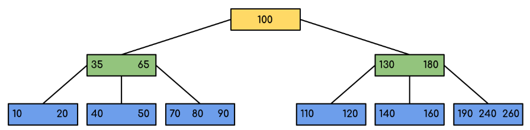
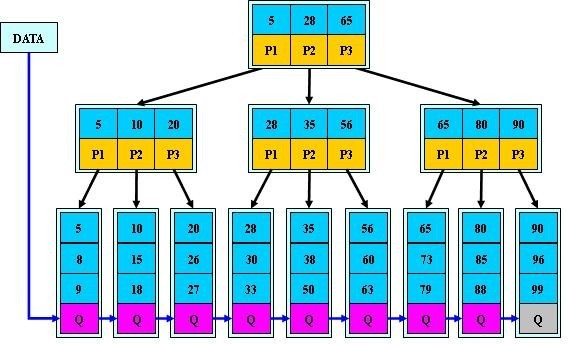

老规律，学习索引前，先提几个问题。

[1、索引是什么？](#索引是什么)

[2、索引有哪些类型？](#索引类型)

[3、如何创建高性能的索引？](#高性能索引)

.....

****

<h1 id="索引是什么">索引是什么？</h1> 

> 索引是一种特殊的数据结构，用于加速数据的检索操作。

<h2 id="索引有哪些类型">索引有哪些类型？</h2>

按数据结构分类可分为：[B tree索引](#Btree索引)、[Hash索引](#Hash索引)、[Full-text索引](#Full-text索引)

按物理存储分类可分为：聚簇索引、二级索引（辅助索引）

按字段特性分类可分为：主键索引、普通索引、前缀索引

按字段个数分类可分为：单列索引、联合索引（复合索引、组合索引）

InnoDB引擎使用[B+tree索引](#B+tree索引)。

<h2 id="高性能索引">如何创建高性能的索引？</h2>

****

**B tree索引**

B Tree(Balance Tree)，也就是平衡树，指任意节点的子树的高度差都小于等于1。

特征：

+ 每个节点最多只有m个子节点。

+ 每个非叶子节点（除了根）具有至少⌈ m/2⌉子节点。

+ 如果根不是叶节点，则根至少有两个子节点。

+ 具有k个子节点的非叶节点包含k -1个键。

+ 所有叶子都出现在同一水平，没有任何信息（高度一致）。

缺点：

+ 当进行范围查找时，存在回旋查找的问题

+ 排序的时候，需要进行一次中序遍历（order by）

**B+ tree索引**

特征：

+ 有m个子树的中间节点包含有m个元素（B树中是k-1个元素），每个元素不保存数据，只用来索引；

+ 所有的叶子结点中包含了全部关键字的信息，及指向含有这些关键字记录的指针，且叶子结点本身依关键字的大小自小而大的顺序链接。 (而B 树的叶子节点并没有包括全部需要查找的信息)；

+ 所有的非终端结点可以看成是索引部分，结点中仅含有其子树根结点中最大（或最小）关键字。 (而B 树的非终节点也包含需要查找的有效信息)；

****

参考：

https://www.cnblogs.com/lianzhilei/p/11250589.html

https://zhuanlan.zhihu.com/p/54102723