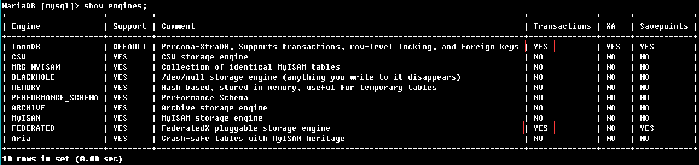

## 事务是什么？

数据库事务是mysql执行操作的最小逻辑单位，一个事务可以包含一个或者多个sql语句，这些sql要么都执行成功要么都执行失败。并发操作下，事务的控制尤为重要。

事务必须同时满足四个特性：原子性、一致性、隔离性、持久性。

## 为什么要使用事务？

可靠性、并发

## 事务是怎么实现的？

+ 事务的原子性是通过 undo log 来实现的
+ 事务的持久性是通过 redo log 来实现的
事务的隔离性是通过[MVCC](https://pdai.tech/md/db/sql-mysql/sql-mysql-mvcc.html) + 读写锁 来实现的
+ 而事务的终极大 boss 一致性是通过原子性，持久性，隔离性来实现的！！！

## 谁实现的事务？

热知识，MySQL是一个支持多引擎的系统，但并不是所有的引擎都支持事务。比如MySQL原生的MyISAM引擎就不支持事务，这也是它被InnoDB取代的重要原因之一。

MySQL 允许在 MySQL 运行时加载和卸载不同的存储引擎。 这种可插入存储引擎体系结构是在表级别实现的，允许不同的存储引擎用于不同的表。

还有哪些引擎支持事务？

