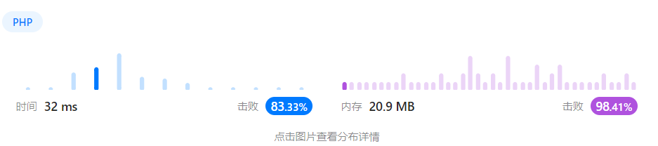
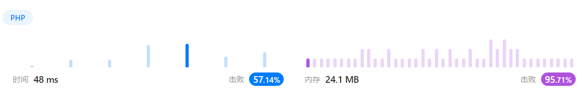

# 目录
* [数组](#数组)
    * [73. 矩阵置零](#矩阵置零)
    * [136. 只出现一次的数字](#只出现一次的数字)
    * [169. 多数元素](#多数元素)
* [滑动窗口](#滑动窗口)
    * [3. 无重复字符的最长子串](#无重复字符的最长子串)
    * [567. 字符串的排列](#字符串的排列)

<h2 id="数组">数组</h2>

### <font style="color:orange"> 题目1 </font>

<a href="https://leetcode.cn/problems/set-matrix-zeroes" id="矩阵置零">73. 矩阵置零</a>

**说明**：

给定一个 m x n 的矩阵，如果一个元素为 0 ，则将其所在行和列的所有元素都设为 0 。请使用 原地 算法。

**示例**：

```
输入：matrix = [[1,1,1],[1,0,1],[1,1,1]]
输出：[[1,0,1],[0,0,0],[1,0,1]]
```

**解题思路**：

+ 遍历矩阵，将为0的元素的行和列存储到两个数组中
+ 再次遍历矩阵，将行和列中的元素置为0

```php
class Solution {

    /**
     * @param Integer[][] $matrix
     * @return NULL
     */
    function setZeroes(&$matrix) {
        $row = [];
        $col = [];

        foreach($matrix as $m => $i) {
            foreach($i as $n => $j) {
                if($j === 0) {
                    $row[$m] = $col[$n] = 1;
                }
            }
        }

        foreach($matrix as $m => &$i) {
            foreach($i as $n => &$j) {
                if($row[$m] || $col[$n]) {
                    $j = 0;
                }
            }
        }
        return $matrix;

    }
}
```

<h2 id="滑动窗口">滑动窗口</h2>

### 介绍

> 滑动窗口算法（Sliding Window）：在给定数组 / 字符串上维护一个固定长度或不定长度的窗口。可以对窗口进行滑动操作、缩放操作，以及维护最优解操作。

+ 滑动操作：窗口可按照一定方向进行移动。最常见的是向右侧移动。
+ 缩放操作：窗口可按照一定规则进行扩大或缩小。最常见的是向右侧扩大。

### 适用场景

滑动窗口算法一般用来解决一些查找满足一定条件的连续区间的性质（长度等）的问题

### <font style="color:orange"> 题目2 </font>

<a href="https://leetcode.cn/problems/longest-substring-without-repeating-characters/" id="无重复字符的最长子串">3. 无重复字符的最长子串</a>

**说明**：

给定一个字符串 s ，请你找出其中不含有重复字符的 最长子串 的长度。

**示例**：

``` 
输入: s = "abcabcbb"
输出: 3 
解释: 因为无重复字符的最长子串是 "abc"，所以其长度为 3。
```

**解题思路**：

+ 用一个数组来存储当前窗口中的字符
+ 用一个变量来记录无重复字符的最长子串的长度
+ 用一个变量来记录当前窗口的起始位置
+ 循环字符串
+ 如果当前字符在数组中存在，则将起始位置移动到第一次出现的位置的下一个位置
+ 将当前字符和当前位置存入窗口中
+ 更新无重复字符的最长子串的长度

```php
class Solution {

    /**
     * @param String $s
     * @return Integer
     */
    function lengthOfLongestSubstring($s) {
        $left = 0;
        $res = 0;
        $window = [];

        $len = strlen($s);
        for($i = 0; $i < $len; $i++) {
            if(isset($window[$s[$i]])) {
                $left = max($left, $window[$s[$i]] + 1);
            }
            $window[$s[$i]] = $i;
            $res = max($res, $i-$left+1);
        }
        return $res;
    }
}
```

### <font style="color:orange"> 题目3 </font>

<a href="https://leetcode.cn/problems/single-number" target="_blank" id="只出现一次的数字">136. 只出现一次的数字</a>

**说明**：

给你一个 非空 整数数组 nums ，除了某个元素只出现一次以外，其余每个元素均出现两次。找出那个只出现了一次的元素。

你必须设计并实现线性时间复杂度的算法来解决此问题，且该算法只使用常量额外空间。

**示例**：

```
输入：nums = [2,2,1]
输出：1
```

**解题思路1**：哈希

+ 用一个哈希表来存储每个元素出现的次数
+ 循环数组，如果元素在哈希表中存在，则将其从hash表中去掉，否则将其值设置为true
+ 返回hash表中的元素

```php
class Solution {

    /**
     * @param Integer[] $nums
     * @return Integer
     */
    function singleNumber($nums) {
        $hash = [];
        foreach($nums as $num) {
            if(isset($hash[$num])) {
                unset($hash[$num]);
            } else {
                $hash[$num] = true;
            }
        }
        return array_keys($hash)[0];
    }
}
```


**解题思路2**：位运算

+ 用一个变量来存储最终的结果
+ 循环数组，将当前元素和结果进行异或运算
+ 返回结果

```php
class Solution {

    /**
     * @param Integer[] $nums
     * @return Integer
     */
    function singleNumber($nums) {
        $res = 0;
        foreach($nums as $num) {
            $res ^= $num;
        }
        return $res;
    }
}
```



### <font style="color:orange"> 题目4 </font>

<a href="https://leetcode.cn/problems/permutation-in-string" target="_blank" id="字符串的排列">567. 字符串的排列</a>

**说明**：

给你两个字符串 s1 和 s2 ，写一个函数来判断 s2 是否包含 s1 的排列。如果是，返回 true ；否则，返回 false 。

换句话说，s1 的排列之一是 s2 的 子串 。

**示例**：

```
输入：s1 = "ab" s2 = "eidbaooo"
输出：true
解释：s2 包含 s1 的排列之一 ("ba").
```

**解题思路1**：滑动窗口

* 用PHP的内置函数count_chars()来统计字符串中每个字符出现的次数

```php
class Solution {

    /**
     * @param String $s1
     * @param String $s2
     * @return Boolean
     */
    function checkInclusion($s1, $s2) {
        $size1 = strLen($s1);
        $size2 = strLen($s2);

        // 如果s1的长度比s2的长度大，直接返回false
        if($s1Len > $s2Len) {
            return false;
        }

        // 统计s1字符串的字符出现情况   返回的是数组，key值是字符的ASCII码值
        $s1CountChars = count_chars($s1, 1);
        
        $start = 0;
        $diff = $size2 - $size1;

        while($start <= $diff) {
            // 从s2中截取出长度为size1的子字符串
            $childStr = substr($s2, $start, $size1);
            // 统计子字符串中每个字符的情况
            $childStrCountChars = count_chars($childStr, 1);

            // 将两个数组作对比
            if($childStrCountChars === $s1CountChars) {
                return true;
            }

            $start++;
        };

        return false; 
    }
}
```


### <font style="color:orange"> 题目5 </font>

<a href="https://leetcode.cn/problems/majority-element" target="_blank" id="多数元素">169. 多数元素</a>

**说明**：

给定一个大小为 n 的数组 nums ，返回其中的多数元素。多数元素是指在数组中出现次数 大于 ⌊ n/2 ⌋ 的元素。

你可以假设数组是非空的，并且给定的数组总是存在多数元素。

**示例**：

```
输入：nums = [3,2,3]
输出：3
```

**解题思路1**：排序

* 将数组排序
* 返回中间位置的元素

```php
class Solution {

    /**
     * @param Integer[] $nums
     * @return Integer
     */
    function majorityElement($nums) {
        sort($nums);
        
        return $nums[count($nums) / 2];
    }
}
```


**解题思路2**：投票法

* 如果我们把众数记为 +1，把其他数记为 −1，将它们全部加起来，显然和大于 0，从结果本身我们可以看出众数比其他数多。

```php
class Solution {

    /**
     * @param Integer[] $nums
     * @return Integer
     */
    function majorityElement($nums) {
        $count = 0;
        $majority = null;

        // 循环数组
        foreach($nums as $num) {
            // 若count为0，则将当前值赋给众数
            if($count === 0) {
                $majority = $num;
            }

            // 若num与众数相等，count + 1
            // 若num与众数不相等，count - 1
            $count += ($num === $majority) ? 1 : -1;
        }

        return $majority;
    }
}
```


