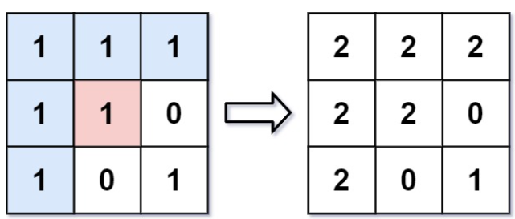
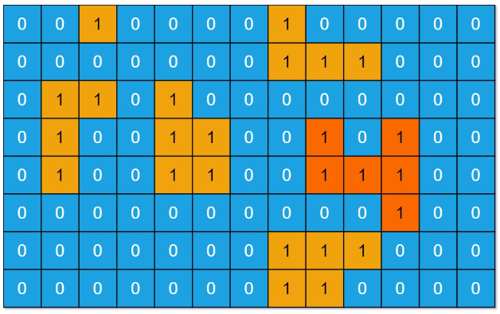

# 目录
* [图](#图)
* [图的遍历](#图的遍历)
    * [深度优先搜索](#深度优先搜索)
        * [733. 图像渲染](#图像渲染)
        * [695. 岛屿的最大面积](#岛屿的最大面积)
    * [广度优先搜索](#广度优先搜索)
    * [拓扑排序](#拓扑排序)

<h2 id="图">图</h2>

### 定义

> 图（Graph）: 由顶点的非空有限集合V（由n > 0个顶点组成）与边的集合E（顶点之间的关系）构成的结构。其形式化定义为：G = (V, E)。

<h2 id="图的遍历">图的遍历</h2>

<h3 id="深度优先搜索">深度优先搜索</h3>

### 定义

> 深度优先搜索算法（Depth First Search）：英文缩写为DFS。是一种用于搜索树或图的算法。所谓深度优先，就是说每次都尝试向更深的节点走。

### 性质

* 在一个V个节点、E条边的图中，使用邻接表表示图，深度优先搜索所需时间与V+E成正比。

### <font style="color:orange"> 题目1 </font>

<a href="https://leetcode.cn/problems/flood-fill" id="图像渲染">733. 图像渲染</a>

**说明**：

有一幅以 m x n 的二维整数数组表示的图画 image ，其中 image[i][j] 表示该图画的像素值大小。

你也被给予三个整数 sr ,  sc 和 newColor 。你应该从像素 image[sr][sc] 开始对图像进行 上色填充 。

为了完成 上色工作 ，从初始像素开始，记录初始坐标的 上下左右四个方向上 像素值与初始坐标相同的相连像素点，接着再记录这四个方向上符合条件的像素点与他们对应 四个方向上 像素值与初始坐标相同的相连像素点，……，重复该过程。将所有有记录的像素点的颜色值改为 newColor 。

最后返回 经过上色渲染后的图像 。

**示例**：



```
输入: image = [[1,1,1],[1,1,0],[1,0,1]]，sr = 1, sc = 1, newColor = 2
输出: [[2,2,2],[2,2,0],[2,0,1]]
解析: 在图像的正中间，(坐标(sr,sc)=(1,1)),在路径上所有符合条件的像素点的颜色都被更改成2。
注意，右下角的像素没有更改为2，因为它不是在上下左右四个方向上与初始点相连的像素点。
```

**解题思路**：深度优先搜索

```php
class Solution {
    protected $rowLen = 0;
    protected $colLen = 0;

    /**
     * @param Integer[][] $image
     * @param Integer $sr
     * @param Integer $sc
     * @param Integer $color
     * @return Integer[][]
     */
    function floodFill($image, $sr, $sc, $color) {
        $currColor = $image[$sr][$sc];

        $this->rowLen = count($image) - 1;
        $this->colLen = count($image[0]) - 1;
        
        if($currColor !== $color) {
            $this -> dfs($image, $sr, $sc, $currColor, $color);
        }

        return $image;
    }

    function dfs(&$image, $x, $y, $currColor, $color) {
        if($image[$x][$y] === $currColor) {
            // 染色
            
            $image[$x][$y] = $color;
            // 将目标色块的上方全部染色
            if($x > 0) {
                $this->dfs($image, $x - 1, $y, $currColor, $color);
            }
            // 将目标色块的下方全部染色
            if($x < $this->rowLen) {
                $this->dfs($image, $x + 1, $y, $currColor, $color);
            }
            // 将目标色块的左方全部染色
            if($y > 0) {
                $this->dfs($image, $x, $y - 1, $currColor, $color);
            }
            // 将目标色块的右方全部染色
             if($y < $this->colLen) {
                $this->dfs($image, $x, $y + 1, $currColor, $color);
            }
        }
    }
}
```

### <font style="color:orange"> 题目2 </font>

<a href="https://leetcode.cn/problems/max-area-of-island" id="岛屿的最大面积">695. 岛屿的最大面积</a>

**说明**：

给你一个大小为 m x n 的二进制矩阵 grid 。

岛屿 是由一些相邻的 1 (代表土地) 构成的组合，这里的「相邻」要求两个 1 必须在 水平或者竖直的四个方向上 相邻。你可以假设 grid 的四个边缘都被 0（代表水）包围着。

岛屿的面积是岛上值为 1 的单元格的数目。

计算并返回 grid 中最大的岛屿面积。如果没有岛屿，则返回面积为 0 。

**示例**：



```
输入：grid = [[0,0,1,0,0,0,0,1,0,0,0,0,0],[0,0,0,0,0,0,0,1,1,1,0,0,0],[0,1,1,0,1,0,0,0,0,0,0,0,0],[0,1,0,0,1,1,0,0,1,0,1,0,0],[0,1,0,0,1,1,0,0,1,1,1,0,0],[0,0,0,0,0,0,0,0,0,0,1,0,0],[0,0,0,0,0,0,0,1,1,1,0,0,0],[0,0,0,0,0,0,0,1,1,0,0,0,0]]
输出：6
解释：答案不应该是 11 ，因为岛屿只能包含水平或垂直这四个方向上的 1 。
```

**解题思路**：深度优先搜索

* 从左上角开始遍历，遇到1就将其变为0，然后将其上下左右的1都变为0，然后计数器加1，然后继续遍历，直到遍历完整个二维数组，最后返回计数器的最大值。

```php
class Solution {

    /**
     * @param Integer[][] $grid
     * @return Integer
     */
    function maxAreaOfIsland($grid) {
        $maxArea = 0;
        
        // 遍历二维数组
        for($i = 0; $i < count($grid); $i++) {
            for($j = 0; $j<count($grid[0]); $j++) {
                $maxArea = max($maxArea, $this->dfs($grid, $i, $j));
            }
        }
        return $maxArea;
    }

    function dfs(&$grid, $x, $y) {
        // 边界条件
        if($x < 0 || $y < 0 || $x === count($grid) || $y === count($grid[0]) || $grid[$x][$y] === 0) {
            return 0;
        }
        
        $dx = [0, 0, 1, -1];
        $dy = [1, -1, 0, 0];

        $grid[$x][$y] = 0;

        $maxArea = 1;

        for($index = 0; $index <  4; ++$index) {
            $next_x = $x + $dx[$index];
            $next_y = $y + $dy[$index];

            $maxArea += $this->dfs($grid, $next_x, $next_y);
        }

        return $maxArea;
    }
}
```

